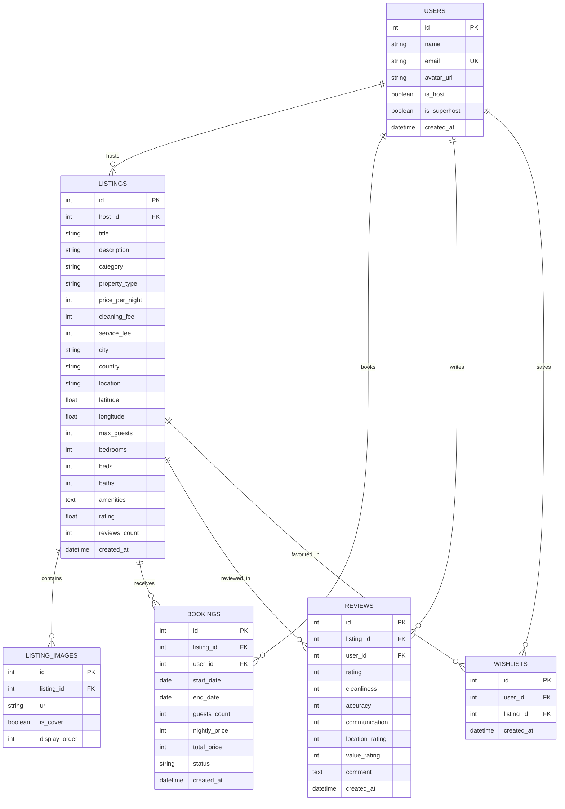

# Airbnb Web Application Clone (Fullstack SDE Assignment)

> **🚀 Live Demo**: [https://frontend-qigobdd1k-nishika841s-projects.vercel.app](https://frontend-qigobdd1k-nishika841s-projects.vercel.app)  
> **📦 GitHub Repository**: [https://github.com/nishika841/airbnb-clone](https://github.com/nishika841/airbnb-clone)

A production-grade, fullstack clone of [Airbnb](https://www.airbnb.com) that replicates Airbnb's iconic design, user experience, and core browse, search, booking, and host workflows.

Built with **Next.js 16 (App Router, TypeScript, Tailwind CSS)** on the frontend, **Python 3.13 (FastAPI, SQLAlchemy, Pydantic)** on the backend, and **SQLite** for relational persistence.

---

## 🌟 Key Features Implemented

### 1. Photo-Forward Explore Page (`/`)
- **Signature Airbnb Navigation**: Coral brand identity (`#FF385C`), interactive pill search bar (*Where | Any week | Add guests*), dark mode switcher, and role switcher (*Guest Alex Rivera ↔ Superhost Elena Rostova*).
- **Category Carousel**: Horizontally scrolling bar featuring authentic icons (*Cabins, Beachfront, Mansions, Amazing pools, Treehouses, Lakefront, Countryside, Skiing, Islands, Iconic cities*).
- **Synchronized Search & Filter Modal**:
  - Full-text destination search across title, city, country, location, and description.
  - Date picker with check-in and checkout range selection.
  - **Granular guest controls** (separate steppers for Adults, Children, and Infants, plus 1-click quick presets: *1 Guest, 2+, 4+, 6+, 8+*).
  - Price range slider/inputs (min/max).
  - Property type selector (*Entire villa, Entire cabin, Entire home, Entire penthouse*).
  - Amenities filter (*Wifi, Pool, Kitchen, Hot tub, Waterfront, AC, etc.*).
- **Multi-Photo Listing Cards**:
  - Image carousel with left/right navigation and pagination indicators.
  - Heart icon with optimistic wishlist synchronization.
  - Dynamic stay counter (e.g., *"Showing 1 – 8 of 16 stays"*).
  - Pagination controls (*Previous, page numbers, Next*).
- **Interactive Map View**:
  - Floating pill toggle (*"Show map" / "Show list"*).
  - Custom Leaflet map with formatted **price pins** (e.g. `$850`, `$420`) using clean, watermark-free OpenStreetMap tiles.
  - Clicking any pin displays a preview card with photo, title, price, and direct link.

### 2. Listing Detail View (`/rooms/[id]`)
- **5-Photo Mosaic Gallery**: 1 prominent hero image + 4-photo grid with hover zoom, plus an interactive **Show all photos** lightbox modal.
- **Host Overview**: Host avatar, Superhost medal badge, verified badge, and **"Generally replies in an hour · Response rate: 100%"** indicator.
- **Property Highlights**: Dedicated workspace, self check-in, and AirCover protection.
- **Sticky Reservation Widget**:
  - Live calendar blocking previously booked dates to prevent overlapping reservations.
  - Directly accessible guest stepper (`[-]` and `[+]`) plus expandable drawer with adult/child breakdowns and presets.
  - Itemized price breakdown: `(rate × nights) + cleaning fee + service fee = Total before taxes`.
  - Dynamic button (`Reserve (2 guests)`) triggering the mock checkout.
- **Guest Reviews Section**: Aggregated rating, 6-metric category ratings (Cleanliness, Accuracy, Communication, Location, Check-in, Value), review cards, and a **"Write a Review"** modal.
- **Location Map**: OpenStreetMap Leaflet embed showing location radius circle.

### 3. Booking Engine & Date Overlap Validation
- Overlap detection algorithm in FastAPI (`start_date < existing.end_date AND end_date > existing.start_date`).
- Confirmed bookings persist immediately in SQLite and automatically block those dates on the listing calendar.
- **Mock Checkout Modal**:
  - Order summary and fee breakdown.
  - Payment method selector (*Credit/Debit Card, PayPal, Apple Pay*).
  - Clear mock indicator banner (*"Mock Checkout — no real charge"*).
  - Instant booking confirmation redirecting to **My Trips (`/trips`)**.

### 4. Trips Management (`/trips`)
- View all active, upcoming, and past reservations.
- Details: Stay photo, dates, nights count, guest count, and total paid.
- **Cancel Reservation** button with confirmation dialog.
- **Leave a Review** action for booked properties.

### 5. Host Dashboard & Management (`/host/*`)
- **Role Switcher**: Toggle seamlessly between demo Guest (*Alex Rivera*) and demo Host (*Elena Rostova*).
- **Host Dashboard (`/host/dashboard`)**:
  - 4 Key Metrics: *Active Listings, Total Bookings, Gross Revenue ($), Average Rating*.
  - Management table for owned listings with Edit, View, and Delete actions.
  - Table of incoming guest bookings with guest info, dates, and payout amounts.
- **Create Listing Wizard (`/host/create`)**:
  - Title, description, category, property type, nightly price, cleaning fee, and capacity.
  - Direct local photo file upload with client-side preview OR image URL entry.
- **Edit Listing (`/host/edit/[id]`)**: Full editing capability for existing listings.

### 6. Messaging System (`/messages`)
- In-app messaging between guest and host.
- Responsiveness indicator: **"Generally replies in an hour · Response rate: 100%"**.
- Message delivery status (*"Just now · Delivered ✓"*).
- "Contact Host" modal accessible directly from listing detail pages.

### 7. Dark Mode & Responsive Layout
- Complete light/dark theme with high-contrast palette (`#121212`, `#1E1E1E`).
- Responsive design across mobile, tablet, and desktop viewports.

---

## 🏗️ System Architecture

```
airbnb-clone/
├── backend/
│   ├── app/
│   │   ├── config.py              # CORS & application settings
│   │   ├── database.py            # SQLite engine, SessionLocal & seeder
│   │   ├── main.py                # FastAPI app entrypoint
│   │   ├── models/                # SQLAlchemy ORM models
│   │   │   ├── user.py            # User model (guests & hosts)
│   │   │   ├── listing.py         # Listing model
│   │   │   ├── listing_image.py   # ListingImage model
│   │   │   ├── booking.py         # Booking model
│   │   │   ├── review.py          # Review model
│   │   │   └── wishlist.py        # Wishlist model
│   │   ├── schemas/               # Pydantic validation schemas
│   │   └── routers/               # Modular REST endpoints
│   │       ├── listings.py        # Listings search, details & CRUD
│   │       ├── bookings.py        # Booking creation, overlap check & cancel
│   │       ├── reviews.py         # Reviews query & submission
│   │       ├── wishlists.py       # Wishlists query & toggle
│   │       └── host.py            # Host dashboard metrics
│   ├── airbnb.db                  # Pre-seeded SQLite database
│   ├── requirements.txt           # Python dependencies
│   ├── Procfile                   # Cloud process definition (Render/Railway)
│   ├── Dockerfile                 # Container image specification
│   └── test_backend.py            # Automated test suite (11/11 passing)
│
├── frontend/
│   ├── src/
│   │   ├── app/                   # Next.js 16 App Router
│   │   │   ├── page.tsx           # Explore page & map toggle
│   │   │   ├── rooms/[id]/        # 5-photo detail view & reservation
│   │   │   ├── trips/             # My Trips management
│   │   │   ├── wishlists/         # Saved stays grid
│   │   │   ├── messages/          # Messaging inbox
│   │   │   └── host/              # Host dashboard & listing CRUD
│   │   ├── components/            # Reusable UI components
│   │   │   ├── layout/            # Navbar, SearchModal, FilterModal, Footer
│   │   │   ├── listings/          # ListingCard, PhotoGallery, ReservationWidget
│   │   │   ├── booking/           # CheckoutModal
│   │   │   └── map/               # MapView (Leaflet + OpenStreetMap)
│   │   ├── context/               # AuthContext, WishlistContext, SearchContext
│   │   └── lib/                   # API client & currency/date helpers
│   ├── package.json
│   └── next.config.ts
│
├── render.yaml                    # 1-click Render blueprint specification
└── README.md
```

---

## 🗄️ Database Schema



---

## 🚀 Local Setup & Installation

### Prerequisites
- **Node.js**: v18.0 or higher
- **Python**: v3.10 or higher
- **Git**

### 1. Clone the Repository
```bash
git clone https://github.com/nishika841/airbnb-clone.git
cd airbnb-clone
```

### 2. Backend Setup (FastAPI + SQLite)
```bash
cd backend

# Create and activate virtual environment
python -m venv .venv
# On Windows:
.\.venv\Scripts\activate
# On macOS / Linux:
# source .venv/bin/activate

# Install dependencies
pip install -r requirements.txt

# Run automated test suite (verifies all 11 endpoints)
python test_backend.py

# Start the FastAPI server
uvicorn app.main:app --host 127.0.0.1 --port 8000 --reload
```
- API Base URL: `http://127.0.0.1:8000`
- Interactive Swagger Documentation: `http://127.0.0.1:8000/docs`

### 3. Frontend Setup (Next.js 16)
```bash
# In a new terminal tab
cd frontend

# Install npm packages
npm install

# Run development server
npm run dev
# Or build and start production server:
# npm run build
# npm run start -- -p 3000
```
- Frontend Application: `http://localhost:3000`

---

## 📡 REST API Overview

| Method | Endpoint | Description | Status Code |
| :--- | :--- | :--- | :---: |
| `GET` | `/api/health` | Service health status check | `200 OK` |
| `GET` | `/api/listings` | Search, filter, paginate stays (`search`, `category`, `guests`, `min_price`, `max_price`, `start_date`, `end_date`) | `200 OK` |
| `GET` | `/api/listings/{id}` | Retrieve complete property details, photos, and host info | `200 OK` |
| `POST` | `/api/listings` | Create a new property listing (Host action) | `201 Created` |
| `PUT` | `/api/listings/{id}` | Update an existing listing | `200 OK` |
| `DELETE` | `/api/listings/{id}` | Delete listing with cascade removal of images/bookings | `200 OK` |
| `GET` | `/api/bookings/listing/{id}/booked-dates` | Retrieve confirmed reservation date ranges | `200 OK` |
| `POST` | `/api/bookings` | Book a stay with automatic date-overlap prevention | `201 Created` / `400 Conflict` |
| `GET` | `/api/bookings/my` | Retrieve bookings for active guest | `200 OK` |
| `DELETE` | `/api/bookings/{id}` | Cancel reservation | `200 OK` |
| `GET` | `/api/reviews/listing/{id}` | Get listing reviews & category averages | `200 OK` |
| `POST` | `/api/reviews/listing/{id}` | Submit guest review and recalculate rating | `201 Created` |
| `GET` | `/api/wishlists` | Get user's saved wishlist listings | `200 OK` |
| `POST` | `/api/wishlists/toggle` | Add/remove listing from wishlists | `200 OK` |
| `GET` | `/api/host/dashboard` | Host metrics (revenue, active stays, bookings) | `200 OK` |

---

## ☁️ Deployment Guide

### Option 1: Vercel (Frontend) + Render / Railway (Backend) — Recommended

#### Step 1: Deploy Backend to Render or Railway
1. Go to [Render Dashboard](https://dashboard.render.com/) or [Railway](https://railway.app/).
2. Click **New Web Service** and select your GitHub repository.
3. Configure:
   - **Root Directory**: `backend`
   - **Build Command**: `pip install -r requirements.txt`
   - **Start Command**: `uvicorn app.main:app --host 0.0.0.0 --port $PORT`
4. Copy your live backend URL (e.g. `https://airbnb-backend-xxxx.onrender.com`).

#### Step 2: Deploy Frontend to Vercel
1. Go to [Vercel Dashboard](https://vercel.com/) and click **Add New Project**.
2. Select your `airbnb-clone` GitHub repository.
3. Configure:
   - **Root Directory**: `frontend`
   - **Framework Preset**: Next.js
   - **Environment Variables**:
     - `NEXT_PUBLIC_API_URL` = `https://airbnb-backend-xxxx.onrender.com/api`
4. Click **Deploy**. Vercel will build and host your app with global edge CDN.

---

### Option 2: 1-Click Fullstack Deploy via Render Blueprint
This repository includes a [`render.yaml`](file:///C:/Users/Nishi/.gemini/antigravity/scratch/airbnb-clone/render.yaml) file:
1. In Render, click **New > Blueprint**.
2. Connect your GitHub repository.
3. Render automatically provisions both the Next.js frontend and FastAPI backend with linked environment variables.

---

## 👥 Demo User Profiles

Use the user profile menu in the navigation bar to switch between:
1. **Alex Rivera (Guest)**: `alex.rivera@example.com`
   - Active reservations in Big Sur and Santorini.
   - Saved favorites in Wishlists.
2. **Elena Rostova (Superhost)**: `elena.rostova@example.com`
   - Superhost badge with 100% response rate.
   - Access to Host Dashboard, listings management, and incoming reservations.